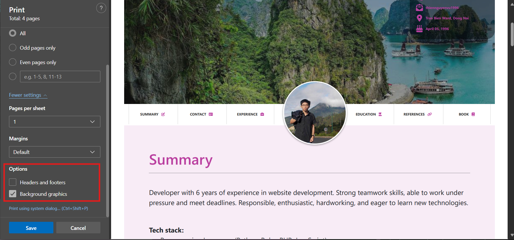

# thiennguyenvu.github.io
Create quickly beauty template CV. See live template at [https://thiennguyenvu.github.io/](https://thiennguyenvu.github.io/)

## User guidle
- Download source code.
- Open `index.html` and edit any content.

### 1. Change primary color:
- Change `hsl` color in `static/css/main.css` at line `2` to any color you want. Or change with `Inspect` of browser then click button `Print CV`.
```
:root {
  --primary-h: 164; /* Change Hue value at here */
  --primary-s: 49%; /* Change Saturation value at here */
  --primary-l: 49%; /* Change Lightness value at here */
}
```

### 2. If you want to change a background of CV:
- Change `header background picture`: 
class `.block-background-image` in `static/css/main.css` at line `32`

- Change `footer background picture`: class `.footer-img` in `static/css/main.css` at line `249`

### 3. Easy get PDF file:

- Click button `Print CV` on top website and wait a dialog open.

- At `Printer`, select `Save as PDF`.


- At `Options`, select `Background graphics`.


- Click `Save` and enjoy your CV.
